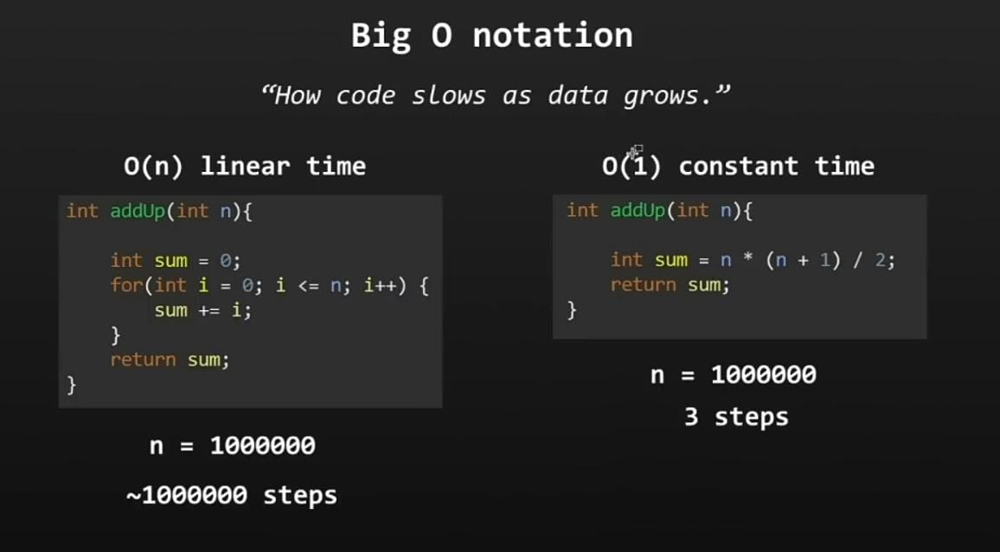
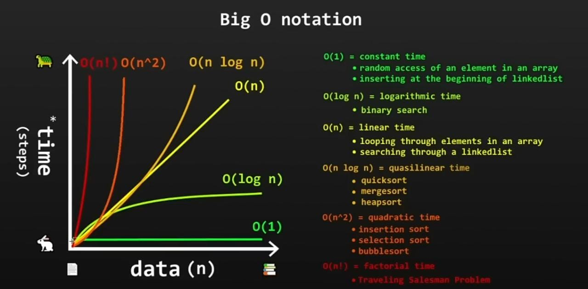
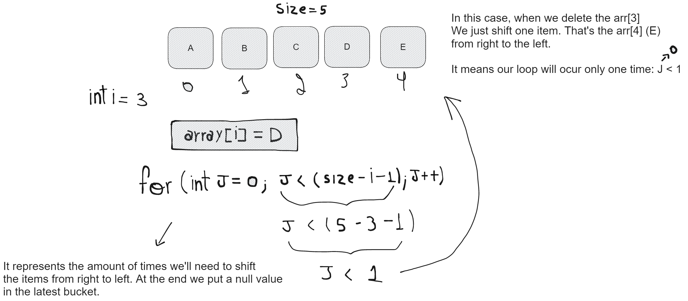

## Data Structure and Algorithms with Java

[Book to Learn Java Language (in Brazilian portuguese)](https://www.caelum.com.br/apostila/apostila-java-orientacao-objetos.pdf)

Learning data structure and algorithms with java by using a Youtube video from
`@Bro Code` channe. The link access is the follows: [Learn Data Structures and Algorithms for free](https://youtu.be/CBYHwZcbD-s)

### Data Structures:

- [Stack](./src/structure/MStack.java)
- [Queues](./src/structure/MQueue.java)
- [Priority Queues](./src/structure/MPriorityQueue.java)
- [Linked List](./src/structure/MLinkedList.java)
- [Dynamic Arrays](./src/structure/MDynamicArray/MDynamicArray.java)
- [Linked List vs Array lists](./src/structure/LinkedListVsArrayList.java)
- [hash tables](./)
- [Graphs](./)
- [Adjacency Matrix](./)
- [Adjacency List](./)
- [Tree](./)

### Concepts

- [Recursion](./)
- [Calculation Execution Time](./)

### Algorithms

- [Linear Search](./src/algorithms/MLinearSearch.java) `O(n)`
- [Binary Search](./src/algorithms//MBinarySearch.java) `O(log n)`
- [Interpolation Search](./)
- [Bubble Sort](./)
- [Selection Sort](./) `O(n^2)`
- [Insertion Sort](./)
- [Merge Sort](./)
- [quick Sort](./) `O(n log n)`
- [Depth First Search](./)
- [Breadth First Search](./)
- [Tree Binary Search](./)
- [Tree Transversal](./)

## Folder Structure

The workspace contains two folders by default, where:

- `src`: the folder to maintain sources
- `lib`: the folder to maintain dependencies

Meanwhile, the compiled output files will be generated in the `bin` folder by default.

> If you want to customize the folder structure, open `.vscode/settings.json` and update the related settings there.

## Dependency Management

The `JAVA PROJECTS` view allows you to manage your dependencies. More details can be found [here](https://github.com/microsoft/vscode-java-dependency#manage-dependencies).
